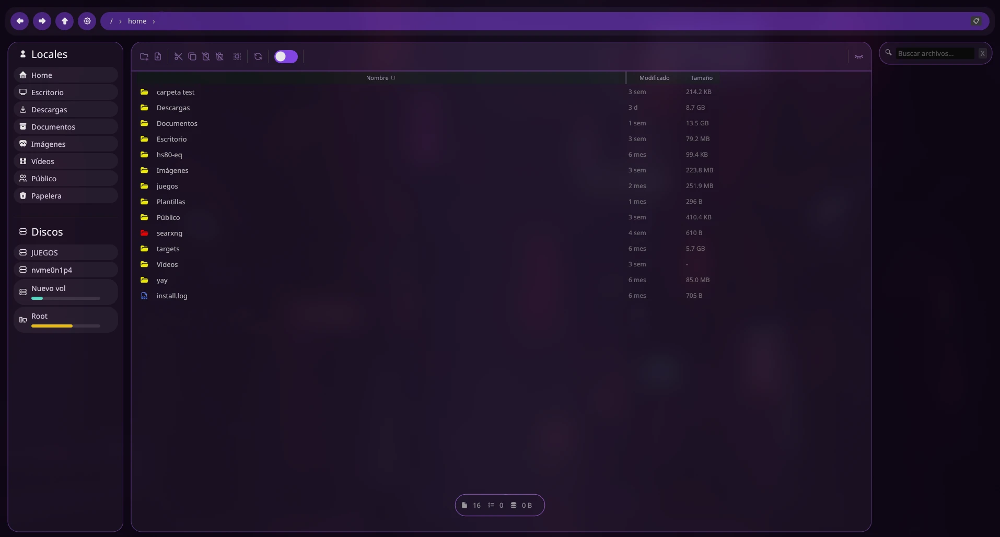
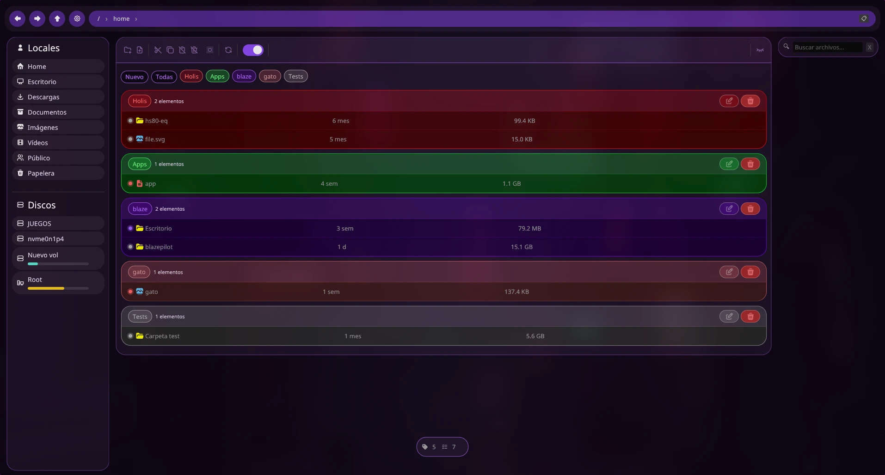

# 🔥 BlazePilot
🌐 **English** | 🇪🇸 **[Español]**
**Explorador de archivos ultrarrápido** hecho con **egui** en Rust ⚡
Un gestor de archivos gráfico moderno, ligero y altamente personalizable. Navega por tus archivos con fluidez, soporte multi-idioma, sistema de tags, thumbnails, integración Git, gestión de discos y mucho más.
Latest Release
Ask DeepWiki
ko-fi


## ✨ Características
### ⚡ Rendimiento
 * Extremadamente rápido gracias a Rust + egui con backend **wgpu** (aceleración por hardware)
 * Asignador de memoria **MiMalloc** para reducir fragmentación
 * Runtime asíncrono **Tokio** — las operaciones de archivos nunca bloquean la UI
 * Caché LRU de 50 directorios con guardado debounced (3s)
### 📁 Operaciones de archivos
 * **Copiar / Cortar / Pegar** con clipboard global y resolución de conflictos
 * **Renombrar** manteniendo el casing original
 * **Eliminar** con soporte de papelera (XDG Trash compliant)
 * **Crear** archivos y carpetas
 * **Mover** con drag & drop
 * **Deshacer** operaciones de archivos (Ctrl+Z)
 * **Extraer ZIP** directamente desde el explorador
### 🔍 Navegación y búsqueda
 * **Navegación por pestañas** con historial (Ctrl+← / Ctrl+→)
 * **Búsqueda recursiva** con prefijo rec: — powered by jwalk
 * **Type-to-search** para filtrado instantáneo en el directorio actual
 * **Scroll automático** al seleccionar resultados de búsqueda
### 🏷️ Sistema de Tags / Quick Access *(v0.11.0)*
 * Tags flexibles que reemplazan los favoritos hardcoded
 * Toggle de vista Tags/Normal con **Ctrl+T**
 * Crear tags con **Ctrl+Shift+T**
 * Isla flotante inferior para gestión de tags
### 🎨 Interfaz y personalización
 * **Colores personalizados por carpeta** con selector y preview en vivo
 * **Thumbnails** con caché persistente en disco
 * **Iconos** con rasterizado SVG y semáforo de concurrencia
 * Paleta de colores centralizada y bordes redondeados
 * **Vista previa de imágenes** en diálogo dedicado
 * Menú contextual completo con todas las operaciones
### 🌍 Internacionalización *(v0.12.0)*
 * **6 idiomas**: inglés, español, francés, alemán, italiano, ruso
 * Cambio de idioma **en runtime** sin reiniciar
### 🖥️ Gestión e Integración con el sistema
 * **Abrir con** — selector de aplicaciones basado en tipo MIME
 * **Abrir en terminal** desde cualquier carpeta
 * **Gestión de discos** — montaje/desmontaje con sidebar de drives (UDisks2 / D-Bus)
 * **Detección MIME real** usando xdg-mime + firma mágica de bytes
 * **Integración Git** — estado de archivos con colores específicos por estado
 * **Actualizaciones automáticas** con notificación de nueva versión
 * **FileId estable** — el identificador persiste aunque renombres o muevas archivos
## ⌨️ Atajos de teclado
### Navegación

| Atajo | Acción |
| :--- | :--- |
| ↑ / ↓ | Seleccionar elemento anterior / siguiente |
| Enter | Abrir carpeta o archivo seleccionado |
| Cmd + A | Seleccionar todo |
| F5 / Cmd + R | Recargar / refrescar |
| Botón ratón Extra1 | Navegar atrás |
| Botón ratón Extra2 | Navegar adelante | <br> ### Operaciones de archivos
| Atajo | Acción |
| :--- | :--- |
| Delete | Eliminar (mover a papelera) |
| Ctrl + Z | Deshacer última operación |
| Cmd + C | Copiar |
| Cmd + X | Cortar |
| Cmd + V | Pegar |
| Cmd + Shift + N | Crear nueva carpeta |
| Cmd + Shift + F | Crear nuevo archivo | <br> ### Búsqueda y vista
| Atajo | Acción |
| :--- | :--- |
| Alt + R | Activar búsqueda recursiva |
| Ctrl + T | Alternar vista Tags / Normal |
| Ctrl + Shift + T | Crear nuevo tag | <br> ### Terminal
| Atajo | Acción |
| :--- | :--- |
| Alt + T | Abrir terminal en el directorio actual | <br> ### Pestañas
| Atajo | Acción |
| :--- | :--- |
| Cmd + N | Nueva pestaña |
| Cmd + W | Cerrar pestaña actual |
| Ctrl + Tab / Ctrl + → | Siguiente pestaña |
| Ctrl + Shift + Tab / Ctrl + ← | Pestaña anterior |
| Ctrl + 1 … Ctrl + 5 | Ir a pestaña 1–5 | <br> ### Diálogos
| Atajo | Acción |
| :--- | :--- |
| Enter | Confirmar (renombrar / crear carpeta o archivo) |
| Escape | Cancelar (renombrar / crear carpeta o archivo) |

## 🚀 Instalación
Solo descarga el binario — no requiere instalación ni dependencias externas:
 1. Ve a la página de **Releases**
 2. Descarga el binario para tu sistema (actualmente solo Linux)
 3. Dale permisos de ejecución:
```bash
chmod +x blazepilot
```
 4. ¡Ejecútalo!
```bash
./blazepilot
```
## 🛠️ Compilar desde fuente
```bash
git clone [https://github.com/Jhanfer/blazepilot.git](https://github.com/Jhanfer/blazepilot.git)
cd blazepilot
cargo run --bin blazepilot
```
## 📋 Roadmap
 * Soporte completo y nativo para Windows y macOS
 * Temas completos y configurables
 * Plugins / extensiones
## 📄 Licencia
Este proyecto está bajo la licencia **Apache License 2.0** — ver el archivo LICENSE para más detalles.
## 💜 ¿Te gusta BlazePilot?
¡Dale una ⭐ al repositorio y ayúdame a crecer! 🚀
Hecho con ❤️ por **Jhanfer**