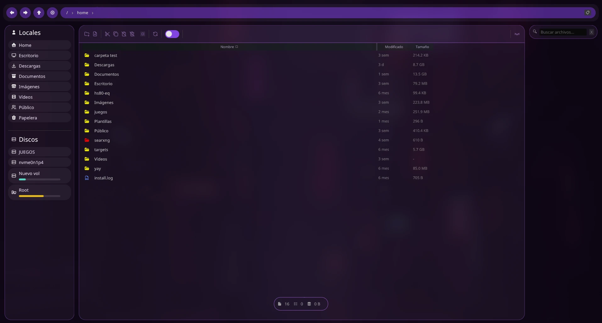
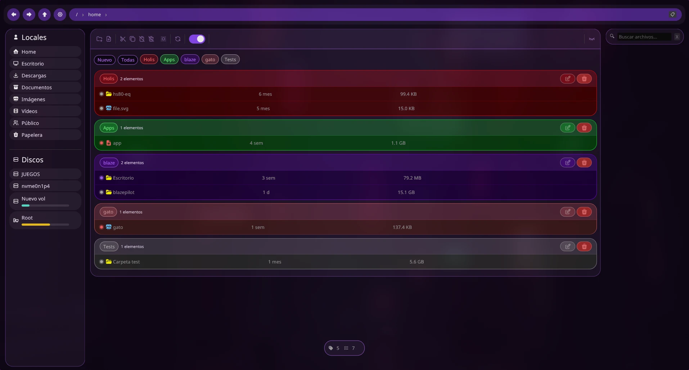

# BlazePilot
🌐 **[English](README.md)** | 🇪🇸 **[Español]**

Explorador de archivos hecho con egui en Rust.

*BlazePilot ha nacido como un proyecto personal. Estaba cansado de las limitaciones de los exploradores que utilizaba a diario, así que empecé a desarrollarlo como una forma de practicar Rust mientras iba aprendiendo, adaptándolo a mis propias necesidades.*

BlazePilot es un gestor de archivos moderno y personalizable. Navega por tus archivos de manera fluida, incorpora un sistema de etiquetas para organizar los archivos, soporte a varios idiomas, miniaturas, soporte parcial a Git, gestión de discos y más.

> [!IMPORTANT]
> Actualmente BlazePilot es compatible con Linux. El soporte para Windows y macOS se encuentra en desarrollo.


[](https://github.com/Jhanfer/blazepilot/releases/latest)
[](https://deepwiki.com/Jhanfer/blazepilot)
[](https://ko-fi.com/jhanfer)




---

## Características

### Rendimiento
- Carga rápida asíncrona de archivos 
- Miniaturas y cálculo del tamaño de los directorios en segundo plano
- Runtime asíncrono **Tokio** para ejecutar operaciones de archivos sin bloquear la interfaz
- Asignador de memoria **mimalloc**

### Operaciones de archivos
- Copiar, pegar, cortar gestionadas por un portapapeles global propio
- Renombrado mantiene el casing original
- Eliminar con soporte a la papelera del sistema
- Crear archivos y carpetas
- Mover con drag & drop dentro de la app
- Deshacer operaciones de archivos con **Ctrl + Z**
- Soporte básico a extracción de ZIP y otros formatos directamente desde el explorador

### Drag & Drop (Wayland)
- Soporte nativo para drag & drop en Wayland
- Detección del tipo de contenido mediante MIME y magic bytes
- Acepta archivos, texto, imágenes y URLs
- Los archivos, imágenes y texto arrastrados se guardan directamente en el directorio actual
- Las URLs de imágenes ofrecen descargarlas
- Las URLs de páginas web pueden abrirse en el navegador

 >[!NOTE]
Cuando se arrastran datos desde otra aplicación, Blaze no depende únicamente del tipo MIME anunciado. Inspecciona los _magic bytes_ del contenido para identificar correctamente imágenes, vídeos, texto, URLs y otros formatos antes de decidir cómo procesarlos.

### Navegación y búsqueda
- Navegación por pestañas **Ctrl + <- / Ctrl + -> / Ctrl + Nums**
- Búsqueda recursiva con el prefijo **rec:** en el buscador
- Búsqueda instantánea al escribir para filtrado en el directorio actual

### Sistema de etiquetas / acceso rápido
- Etiquetas que permiten organización por tipos
- Toggle de vista etiquetas/normal con **Ctrl+T**
- Crear etiqueta con **Ctrl + Shift + T**

### Interfaz y personalización
- Colores de carpeta personalizables
- Miniaturas con caché persistente en disco
- Iconos con rasterizado SVG y semáforo de concurrencia
- Paleta de colores centralizada y bordes redondeados
- Vista previa de imágenes en diálogo dedicado

### Internacionalización
- **6 idiomas**: inglés, español, francés, alemán, italiano, ruso
- Cambio de idioma en runtime sin reiniciar

### Gestión e Integración con el sistema
- *Abrir con...* inicializa un selector de aplicaciones basado en tipo MIME
- Abrir la terminal desde cualquier carpeta
- Gestión de discos con montaje y desmontaje
- Integración Git que lee estados de los archivos de un repositorio local
- Actualizaciones automáticas con notificación de nueva versión
- Identificador de archivos con File ID persistente
- Ofrece instalar en caso de no estar instalado

---

## Atajos de teclado

### Navegación

| Atajo              | Acción                                    |
| :----------------- | :---------------------------------------- |
| `↑` / `↓`          | Seleccionar elemento anterior o siguiente |
| `Enter`            | Abrir carpeta o archivo seleccionado      |
| `Cmd + A`          | Seleccionar todo                          |
| `F5` / `Cmd + R`   | Recargar / refrescar                      |
| Botón ratón Extra1 | Navegar atrás                             |
| Botón ratón Extra2 | Navegar adelante                          |

### Operaciones de archivos

| Atajo             | Acción                                                     |
| :---------------- | :--------------------------------------------------------- |
| `Delete`          | Mover a papelera (eliminar si ya se encuentra en papelera) |
| `Ctrl + Z`        | Deshacer última operación                                  |
| `Cmd + C`         | Copiar                                                     |
| `Cmd + X`         | Cortar                                                     |
| `Cmd + V`         | Pegar                                                      |
| `Cmd + Shift + N` | Crear nueva carpeta                                        |
| `Cmd + Shift + F` | Crear nuevo archivo                                        |

### Búsqueda y vista

| Atajo              | Acción                            |
| :----------------- | :-------------------------------- |
| `Alt + R`          | Activar búsqueda recursiva        |
| `Ctrl + T`         | Alternar vista etiquetas / normal |
| `Ctrl + Shift + T` | Crear nuevo tag                   |

### Terminal

| Atajo | Acción |
| :--- | :--- |
| `Alt + T` | Abrir terminal en el directorio actual |

### Pestañas

| Atajo                              | Acción                |
| :--------------------------------- | :-------------------- |
| `Cmd + N`                          | Nueva pestaña         |
| `Cmd + W`                          | Cerrar pestaña actual |
| `Ctrl + Tab` / `Ctrl + ->`         | Siguiente pestaña     |
| `Ctrl + Shift + Tab` / `Ctrl + <-` | Pestaña anterior      |
| `Ctrl + 1` … `Ctrl + 5`            | Ir a pestaña 1–5      |

### Renombrado y creación de archivos

| Atajo    | Acción                                        |
| :------- | :-------------------------------------------- |
| `Enter`  | Confirmar renombrar / crear carpeta o archivo |
| `Escape` | Cancelar renombrar / crear carpeta o archivo  |

---

## Instalación

BlazePilot se distribuye como un único binario. Basta con descargarlo y ejecutarlo:
> [!NOTE]
> BlazePilot utiliza `wgpu` como renderizador de eframe, por lo que requiere un sistema con soporte gráfico compatible (Vulkan en la mayoría de distribuciones Linux).

1. Ve a la página de **[Releases](https://github.com/Jhanfer/blazepilot/releases/latest)**
2. Descarga el binario para tu sistema (actualmente Blaze es sólo compatible con Linux)
> [!IMPORTANT]
A partir de la versión **0.18.0**, BlazePilot requiere que las bibliotecas de FFmpeg estén instaladas en el sistema. En la mayoría de distribuciones Linux basta con instalar FFmpeg:
>- Arch Linux / Manjaro:
>`sudo pacman -S ffmpeg`
>- Ubuntu / Debian
>	`sudo apt install ffmpeg`
>- Fedora
`sudo dnf install ffmpeg`

3. Dale permisos de ejecución:

```bash
chmod +x blazepilot-x86_64-unknown-linux-gnu-vX.X.X
```

4. ¡Ejecútalo!

```bash
./blazepilot-x86_64-unknown-linux-gnu-vX.X.X
```

---

## Compilar desde fuente

```bash
git clone https://github.com/Jhanfer/blazepilot.git
cd blazepilot
cargo run --bin blazepilot
```

>[!NOTE]
>**Requisitos de compilación**
>- rust nightly
>- cargo
>- make
>- ninja
>- nasm
>- libdav1d
>- pkg-config 
>- Headers de desarrollo para X11, Wayland y D-Bus


---

## Estado del proyecto

BlazePilot está en desarrollo activo. Aunque ya es utilizable, algunas funcionalidades continúan evolucionando y la compatibilidad con Windows y macOS todavía está en desarrollo.

---

## Roadmap

- Soporte completo y nativo para Windows y macOS
- Temas completos y configurables (todavía WIP)
- Plugins o extensiones

---

## Licencia

Este proyecto está bajo la licencia **Apache License 2.0**. Ver el archivo `LICENSE` para más detalles.

---

## ¿Te gusta BlazePilot?

¡Dale una ⭐ al repositorio y ayúdame a crecer!

Hecho con ❤️ por **[Jhanfer](https://github.com/Jhanfer/)**