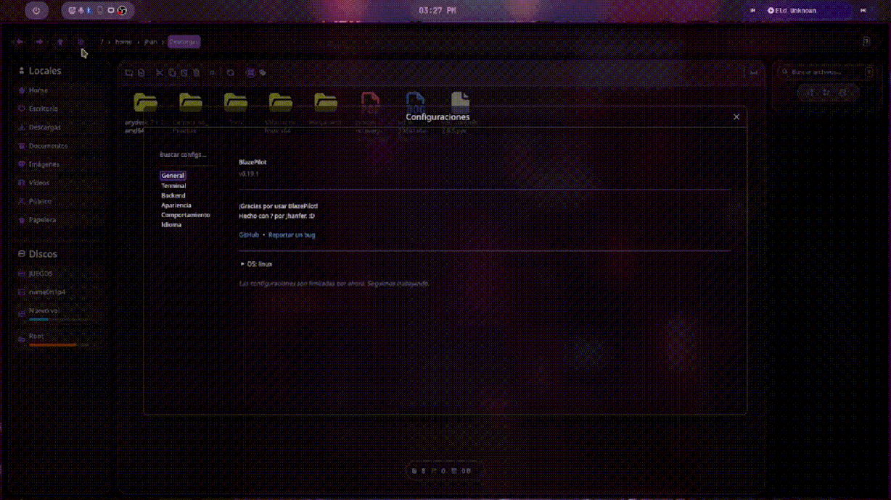
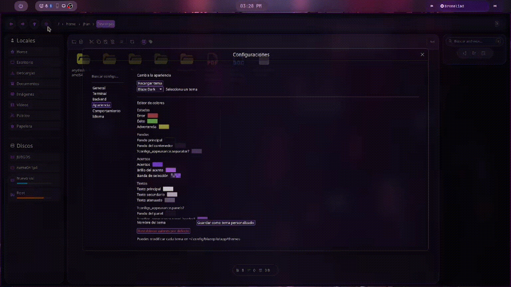
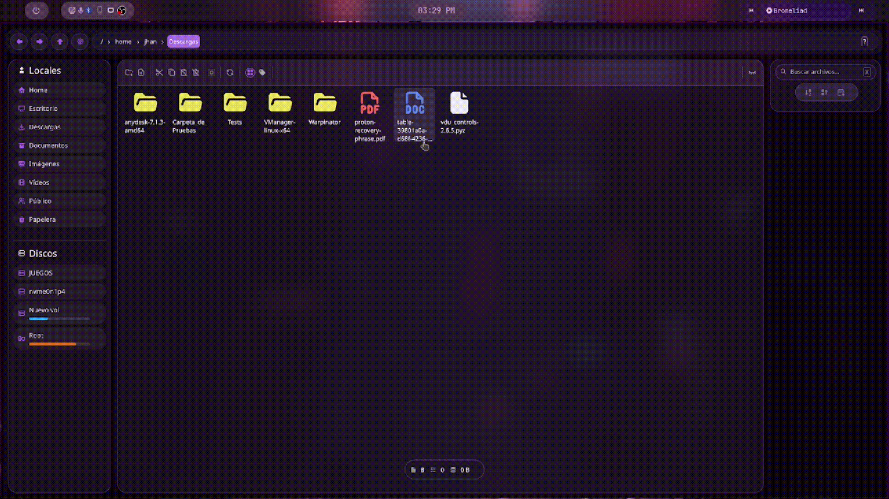

<p align="center">
  
</p>

<h1 align="center">BlazePilot</h1>

<p align="center">
  🌐 <strong>English</strong> • 🇪🇸 <a href="README.es.md"><strong>Español</strong></a>
</p>

<p align="center">
  File explorer made with <b>Egui</b> in <b>Rust</b>.
</p>

*BlazePilot was born as a personal project. I was tired of the limitations of the explorers I used daily, so I started developing it as a way to practice Rust while learning, adapting it to my own needs.*

BlazePilot is a modern and customizable file manager. Navigate through your files smoothly, incorporates a tag system to organize files, support for multiple languages, thumbnails, partial Git support, disk management and more.

> [!IMPORTANT]
> Currently BlazePilot is compatible with Linux. Support for Windows and macOS is under development.

<p align="center">
  
  
  
  <a href="https://github.com/Jhanfer/blazepilot/releases/latest">
    
  </a>
  <a href="https://deepwiki.com/Jhanfer/blazepilot">
    
  </a>
  <a href="https://ko-fi.com/jhanfer">
    
  </a>
</p>

---

## Features

### Performance
- Fast asynchronous file loading
- Thumbnails and directory size calculation in the background
- **Tokio** async runtime to run file operations without blocking the interface
- **mimalloc** memory allocator

<p align="center">
	
</p>

### File operations
- Copy, paste, cut managed by a custom global clipboard
- Renaming preserves original casing
- Delete with system trash support
- Create files and folders
- Move with drag & drop within the app
- Undo file operations with **Ctrl + Z**
- Basic support for extracting ZIP and other formats directly from the explorer

<p align="center">
	
</p>

### Drag & Drop (Wayland)
- Native support for drag & drop on Wayland
- Content type detection using MIME and magic bytes
- Accepts files, text, images and URLs
- Dragged files, images and text are saved directly to the current directory
- Image URLs offer to download them
- Web page URLs can be opened in the browser

 >[!NOTE]
When dragging data from another application, Blaze does not rely solely on the announced MIME type. It inspects the _magic bytes_ of the content to correctly identify images, videos, text, URLs and other formats before deciding how to process them.

<p align="center">
	
</p>

### Navigation and search
- Tab navigation **Ctrl + <- / Ctrl + -> / Ctrl + Nums**
- Recursive search with the prefix **rec:** in the search box
- Instant search while typing to filter in the current directory

<p align="center">
	
</p>

### Tag / quick access system
- Tags that allow organization by types
- Toggle tags/normal view with **Ctrl+T**
- Create tag with **Ctrl + Shift + T**

<p align="center">
	
</p>

### Interface and customization
- Customizable folder colors
- Thumbnails with persistent disk cache
- Icons with SVG rasterization and concurrency semaphore
- Centralized color palette and rounded borders
- Image preview in dedicated dialog

<p align="center">
	
</p>

### Internationalization
- **6 languages**: English, Spanish, French, German, Italian, Russian
- Runtime language switching without restarting

<p align="center">
	
</p>

### System Management and Integration
- *Open with...* launches an application picker based on MIME type
- Open terminal from any folder
- Disk management with mounting and unmounting
- Git integration that reads file statuses from a local repository
- Automatic updates with new version notification
- File identifier with persistent File ID
- Offers to install if not already installed

<p align="center">
	
</p>

---

## Keyboard shortcuts

### Navigation

| Shortcut            | Action                       |
| :------------------ | :--------------------------- |
| `↑` / `↓`           | Select previous or next item |
| `Enter`             | Open selected folder or file |
| `Cmd + A`           | Select all                   |
| `F5` / `Cmd + R`    | Reload / refresh             |
| Mouse button Extra1 | Navigate back                |
| Mouse button Extra2 | Navigate forward             |

### File operations

| Shortcut           | Action                                                     |
| :----------------  | :--------------------------------------------------------- |
| `Delete`           | Move to trash (delete if already in trash)                 |
| `Ctrl + Z`         | Undo last operation                                        |
| `Cmd + C`          | Copy                                                       |
| `Cmd + X`          | Cut                                                        |
| `Cmd + V`          | Paste                                                      |
| `Cmd + Shift + N`  | Create new folder                                          |
| `Cmd + Shift + F`  | Create new file                                            |

### Search and view

| Shortcut           | Action                            |
| :----------------  | :-------------------------------- |
| `Alt + R`          | Activate recursive search         |
| `Ctrl + T`         | Toggle tags / normal view         |
| `Ctrl + Shift + T` | Create new tag                    |

### Terminal

| Shortcut | Action |
| :---     | :--- |
| `Alt + T` | Open terminal in current directory |

### Tabs

| Shortcut                           | Action                |
| :--------------------------------- | :-------------------- |
| `Cmd + N`                          | New tab               |
| `Cmd + W`                          | Close current tab     |
| `Ctrl + Tab` / `Ctrl + ->`         | Next tab              |
| `Ctrl + Shift + Tab` / `Ctrl + <-` | Previous tab          |
| `Ctrl + 1` … `Ctrl + 5`            | Go to tab 1–5         |

### Renaming and file creation

| Shortcut | Action                                        |
| :------- | :-------------------------------------------- |
| `Enter`  | Confirm rename / create folder or file        |
| `Escape` | Cancel rename / create folder or file         |

---

## Installation

BlazePilot is distributed as a single binary. Just download and run it:
> [!NOTE]
> BlazePilot uses `wgpu` as eframe's renderer, so it requires a system with compatible graphics support (Vulkan on most Linux distributions).

1. Go to the **[Releases](https://github.com/Jhanfer/blazepilot/releases/latest)** page
2. Download the binary for your system (currently Blaze is only compatible with Linux)
 > [!IMPORTANT]
> Starting with version **0.18.0**, BlazePilot requires:
> - ALSA for audio output:
>   - Arch Linux / Manjaro: `sudo pacman -S alsa-lib`
>   - Ubuntu / Debian: `sudo apt install libasound2`
>   - Fedora: `sudo dnf install alsa-lib`

3. Give it execution permissions:

```bash
chmod +x blazepilot-x86_64-unknown-linux-gnu-vX.X.X
```

4. Run it!

```bash
./blazepilot-x86_64-unknown-linux-gnu-vX.X.X
```

---

## Build from source

```bash
git clone https://github.com/Jhanfer/blazepilot.git
cd blazepilot
cargo run --bin blazepilot
```

> [!NOTE]
> **Build Requirements**
> - Rust nightly
> - Cargo
> - Meson
> - Ninja
> - NASM
> - YASM
> - pkg-config
> - OpenSSL (`libssl-dev`)
> - ALSA (`libasound2-dev`)
> - FFmpeg development libraries (`libavutil`, `libavcodec`, `libavformat`, `libswscale`, `libavfilter`, `libswresample`)
> - dav1d (`libdav1d-dev`)
> - Development libraries for:
>   - X11 (`libx11-dev`)
>   - XKB (`libxkbcommon-dev`, `libxkbcommon-x11-dev`)
>   - Wayland (`libwayland-dev`)
>   - OpenGL / EGL / GLES (`libgl1-mesa-dev`, `libegl1-mesa-dev`, `libgles2-mesa-dev`)
>   - Vulkan (`libvulkan-dev`)
>   - D-Bus (`libdbus-1-dev`)


---

## Project status

BlazePilot is in active development. Although it is already usable, some features continue to evolve and compatibility with Windows and macOS is still under development.

---

## Roadmap

- Full and native support for Windows and macOS
- Complete and configurable themes (still WIP)
- Plugins or extensions

---

## License

This project is licensed under the **Apache License 2.0**. See the `LICENSE` file for more details.

---

## Do you like BlazePilot?

Give the repo a ⭐ and help me grow!

Made with ❤️ by **[Jhanfer](https://github.com/Jhanfer/)**"